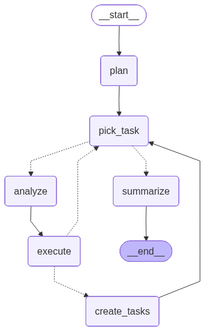

# agenta

agentmake is a Python rebuild of the AgentGPT-style agent loop using LangGraph
and LangChain. The goal is to move the autonomous agent brain out of the browser
and into one server-side state machine that can later be streamed through an API.

Right now, agentmake can run as a headless CLI agent or as a FastAPI service.
It can take a goal, plan tasks, choose a tool for each task, execute those
tasks, optionally add follow-up tasks, stream progress events, pause and resume
runs, summarize the results, and answer follow-up questions over completed run
results.

## Current Status

Implemented through **optional task expansion**:

- A LangGraph `StateGraph` owns the agent loop.
- Goals are converted into structured task lists.
- Each task is picked from a queue and analyzed.
- The analyzer chooses one registered tool:
  - `reason`
  - `search`
  - `code`
  - `conclude`
- The executor runs the selected tool and stores the result.
- When `expand_tasks` is enabled, the agent can add one deduped follow-up task
  after each completed task.
- The summarizer combines all task results into a final answer.
- Completed runs can be queried through DB-backed chat endpoints.
- The CLI can run the full loop end to end.
- FastAPI exposes:
  - `GET /healthz`
  - `GET /tools`
  - `POST /runs`
  - `GET /runs/{run_id}`
  - `GET /runs/{run_id}/stream`
  - `POST /runs/{run_id}/pause`
  - `POST /runs/{run_id}/resume`
  - `POST /runs/{run_id}/cancel`
  - `GET /runs/{run_id}/chat`
  - `POST /runs/{run_id}/chat`
- The stream endpoint emits SSE progress events from graph updates.
- Run state and chat messages are stored in SQLite at `data/runs.sqlite`.
- LangGraph checkpoints are stored in SQLite at `data/checkpoints.sqlite`.
- Streams resume from the latest LangGraph checkpoint when a run is restarted.
- Pause and cancel requests stop after the current graph node finishes.
- On API startup, stale `running` runs are marked `failed`.
- Railway config-as-code is available in `railway.toml`.
- Focused tests cover tools, graph routing, analyze fallback, and API streaming.

Not implemented yet:

- Durable user memory
- Frontend

## Architecture At A Glance



The current graph is:

```text
START
  -> plan
  -> pick_task
  -> analyze
  -> execute
  -> optional create_tasks
  -> pick_task
  -> ...
  -> summarize
  -> END
```

The important loop is:

```text
pick_task -> analyze -> execute -> optional create_tasks -> pick_task
```

That means each task gets its own tool decision before execution, and runs that
opt in to expansion can adapt the queue as results come in.

## How The Agent Works

1. `scripts/run_cli.py` creates the initial state from your goal.
2. `app/agent/graph.py` builds the LangGraph workflow.
3. `plan_node` creates a task list from the goal.
4. `pick_task_node` selects the next task.
5. `analyze_node` chooses the best tool with structured `ToolChoice` output.
6. `execute_node` runs the selected tool.
7. `create_tasks_node` optionally adds one new follow-up task when expansion is enabled.
8. The graph loops until no tasks remain or `max_loops` is reached.
9. `summarize_node` writes the final summary.

## Project Structure

```text
app/
  settings.py              # Provider, model, language, loop settings
  agent/
    graph.py               # LangGraph wiring
    nodes.py               # plan, pick_task, analyze, execute, create_tasks, summarize
    state.py               # AgentState and Analysis shape
    schemas.py             # Plan, ToolChoice, FollowupTask, ToolName
    prompts.py             # Fixed agent prompt templates
    models.py              # LLM factory
    tools/
      base.py              # Tool protocol and registry
      reason.py            # General LLM reasoning tool
      search.py            # DuckDuckGo search with cited summary
      code.py              # Code-focused LLM tool
      conclude.py          # Task conclusion tool
  api/
    main.py                # FastAPI app, CORS, run creation, SSE stream
    schemas.py             # API request/response schemas
  chat/
    chat.py                # Grounded chat over completed run results
  persistence/
    run_store.py           # SQLite storage for runs, agent state, chat messages
    checkpointer.py        # LangGraph SQLite checkpoint helpers
scripts/
  run_cli.py               # Headless CLI entrypoint
tests/
  test_analyze.py          # Analyze-node behavior and fallback tests
  test_api.py              # FastAPI and SSE stream tests
  test_graph.py            # Graph routing and fake-model loop tests
  test_tools.py            # Tool registry and tool behavior tests
docs/
  assets/
    agent_graph_mermaid.png
```

## Run The CLI

Install dependencies with `uv`, then set your LLM key in `.env`.

Example `.env`:

```text
GROQ_API_KEY=your_key_here
```

Run a goal:

```bash
uv run python scripts/run_cli.py "Search for LangGraph documentation and write a tiny Python example"
```

## Run The API

Start the FastAPI server from the `code/` directory:

```bash
uv run uvicorn app.api.main:app --reload --port 8000
```

Open the generated API docs:

```text
http://127.0.0.1:8000/docs
```

Health check:

```bash
curl http://127.0.0.1:8000/healthz
```

List available tools:

```bash
curl http://127.0.0.1:8000/tools
```

Create a run:

```bash
curl -X POST http://127.0.0.1:8000/runs \
  -H "Content-Type: application/json" \
  -d '{"goal":"Write a short explanation of LangGraph"}'
```

Create a run with optional task expansion:

```bash
curl -X POST http://127.0.0.1:8000/runs \
  -H "Content-Type: application/json" \
  -d '{"goal":"Research LangGraph checkpointing","expand_tasks":true}'
```

Copy the returned `run_id`, then stream that run:

```bash
curl -N http://127.0.0.1:8000/runs/YOUR_RUN_ID/stream
```

Read a stored run:

```bash
curl http://127.0.0.1:8000/runs/YOUR_RUN_ID
```

Pause a running stream:

```bash
curl -X POST http://127.0.0.1:8000/runs/YOUR_RUN_ID/pause
```

Resume a paused run, then reconnect the stream:

```bash
curl -X POST http://127.0.0.1:8000/runs/YOUR_RUN_ID/resume
curl -N http://127.0.0.1:8000/runs/YOUR_RUN_ID/stream
```

Cancel a created, running, or paused run:

```bash
curl -X POST http://127.0.0.1:8000/runs/YOUR_RUN_ID/cancel
```

Ask a completed run a follow-up question:

```bash
curl -X POST http://127.0.0.1:8000/runs/YOUR_RUN_ID/chat \
  -H "Content-Type: application/json" \
  -d '{"question":"What did this run conclude?"}'
```

Read stored chat history for a run:

```bash
curl http://127.0.0.1:8000/runs/YOUR_RUN_ID/chat
```

The stream currently emits these SSE event types:

```text
status
node
plan
task
analysis
task_done
task_created
summary
error
done
```

Each SSE message uses a normalized JSON body:

```json
{
  "run_id": "uuid",
  "sequence": 1,
  "type": "status",
  "payload": {
    "status": "running"
  }
}
```

The SSE `event:` name matches the JSON `type`. `sequence` starts at `1` for
each stream connection and increments by one for every event sent on that
connection.

Run state is stored in SQLite:

```text
data/runs.sqlite
```

The same database also stores run chat history in `chat_messages`.

LangGraph checkpoints are stored separately:

```text
data/checkpoints.sqlite
```

The run store keeps API-facing status and serialized `AgentState`; the
checkpoint database lets LangGraph continue a paused run from its latest
checkpoint. On resume, the API skips cached checkpoint updates so already-saved
task results are not duplicated in the stored run state.

## Deploy On Railway

`railway.toml` starts the API with:

```bash
uv run uvicorn app.api.main:app --host 0.0.0.0 --port $PORT
```

Minimum Railway variables:

```text
GROQ_API_KEY=your_key_here
RUN_DB_PATH=data/runs.sqlite
CHECKPOINT_DB_PATH=data/checkpoints.sqlite
```

For persistence across redeploys, attach a Railway volume and point both DB
paths at the mounted volume, for example:

```text
RUN_DB_PATH=/data/runs.sqlite
CHECKPOINT_DB_PATH=/data/checkpoints.sqlite
```

Health check path:

```text
/healthz
```

## Quality Checks

Run quality checks:

```bash
uv run ruff check .
uv run mypy --cache-dir /tmp/agentmake-mypy-cache .
uv run pytest -q -p no:cacheprovider
```

To run only API tests:

```bash
uv run pytest -q tests/test_api.py -p no:cacheprovider
```

Do not run test files directly with `python tests/test_api.py`; pytest reads the
project `pythonpath` config from `pyproject.toml`, while direct Python execution
does not.

## Tool System

Tools register themselves in `app/agent/tools/base.py`.

The analyzer sees tool descriptions from the registry, then returns:

```python
{
    "reasoning": "Why this tool fits the task",
    "action": "search",
    "arg": "query or tool input",
}
```

The executor then runs:

```python
tool = get_tool(analysis["action"])
result = await tool.run(...)
```

If the model returns an invalid tool choice, the system falls back to `reason`.

## Current Milestones

```text
M1   complete: headless graph with plan -> execute -> summarize
M2a  complete: prompts and ToolChoice schema
M2b  complete: tool registry, reason, conclude
M2c  complete: search and code tools
M2d  complete: analyze_node and selected-tool execution
M3a  complete: FastAPI shell with health, tools, and run creation
M3b  complete: SSE run stream endpoint
M3c  complete: graph progress events over SSE
M3d  complete: SQLite run persistence
M3e  complete: stale running-run recovery on startup
M3f  complete: LangGraph SQLite checkpointing
M3g  complete: pause, resume, and cancel run controls
M3h  complete: Railway deployment config
M4a  complete: optional task expansion
M4b  complete: DB-backed chat over completed run results
```

## Next Steps

Recommended next work:

1. Start the frontend SSE client.
2. Add durable user memory.
3. Add run history/list endpoints.

M3 target API:

```text
POST /runs
GET  /runs/{run_id}
GET  /runs/{run_id}/stream
POST /runs/{run_id}/pause
POST /runs/{run_id}/resume
POST /runs/{run_id}/cancel
GET  /runs/{run_id}/chat
POST /runs/{run_id}/chat
GET  /tools
GET  /healthz
```

The long-term product goal is a Railway-hosted Python brain with a Vercel
frontend that streams agent progress from the server-side LangGraph run.
